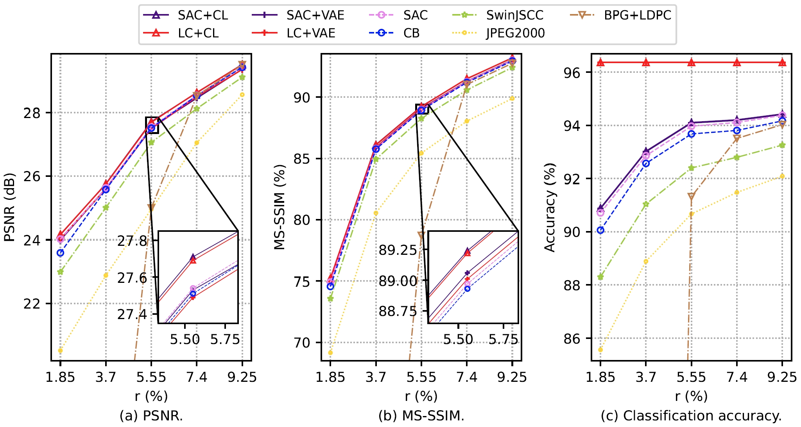
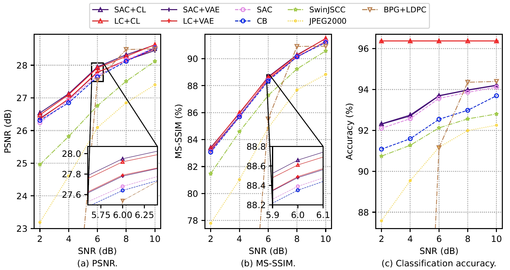

# Codebook-Assisted Image Semantic Communications (Swin Transformer-Based Approach)

Pytorch implementation of the [paper](https://ieeexplore.ieee.org/document/10654371) "Improving Learning-Based Semantic Coding Efficiency for Image Transmission via Shared Semantic-Aware Codebook".

# Introduction
Recently, codebook-assisted semantic communications have been developed to bridge the gap between end-to-end strategies and module-based methods, which have showcased superior performance in data reliability and transmission efficiency. However, most of these approaches encounter two key issues. Firstly, they do not construct the codebook from the semantic perspective, causing a performance decline in semantic information recovery. Secondly, the semantic coder neural network is trained solely on traditional loss functions. Hence, there may be redundancy between the received signal and codeword, which compromises transmission efficiency. In this paper, we tackle the above issues through several key contributions. We first propose a novel approach for constructing a semantic-aware codebook, leveraging an innovative distance measure that unifies the objectives of codebook construction and semantic coding. We also propose a codebook construction method based on classification results, serving as a special version of the proposed method. To further enhance transmission efficiency, we optimize the Swin Transformer-based coder by the proposed Wyner-Ziv coding-based loss function, where a penalty term aims to mitigate the redundancy in the received signals. The performance of the proposed approach is comprehensively validated over both an AWGN channel and a Rayleigh fading channel. Numerical results demonstrate that the proposed method outperforms traditional methods in terms of both semantic information recovery and source data reconstruction.


>  Illustration of the proposed semantic communication system, where the dashed arrows are utilized only over the fading channel.


>  Illustration of the proposed semantic coder structure.


>  Illustration of the SwinJSCC part (from the [paper](https://arxiv.org/abs/2211.00937) "WITT: A Wireless Image Transmission Transformer For Semantic Communications").


# Prerequites
* [Python 3.8]
* [PyTorch 1.9]


# Quick Start

## Codebook Construction

### Task-Unaware Codebook Construction
To construct a task-unaware codebook for the SCC method.
```bash
$ python CB_construction.py
```

### Semantic-Aware Codebook Construction
To construct a task-aware codebook for the PSC and SCSC methods.
```bash
$ python SC_construction.py
```

### Label-Based Codebook Construction
To construct a label-based task-aware codebook for the PLSC methods.
```bash
$ python LSC_construction.py
```

## Classifier Pre-Training
To pre-tain the classifier with the raw images for all the methods.
```bash
$ python googlenet_train.py
```


# Usage

## PS
* For the AWGN channel, please choose 'WITT_W/O' and 'awgn'
* For the Rayleigh fading channel, please select 'WITT' and 'rayleigh'
* When using the proposed loss function, performance may be erratic in some cases. Therefore, depending on the actual situation, you may need to use a smaller weight value.
* It is recommended to train the pre-training model on AWGN channels with a high SNR. Then, based on the pre-trained model, train again at other SNRs or over the Rayleigh fading channel to achieve a more stable performance.
* To obtain performance with different codebooks or at different SNRs, it is only necessary to utilize the codec trained based on one codebook or at one SNR as a pre-trained model, and then fine-tune it to achieve rapid convergence of the semantic codec training.

## CB w/o Loss, SAC w/o Loss, LC w Loss, SAC w Loss
* CB w/o Loss: trainCBFading.py
* SAC w/o Loss: trainSCFading.py
* LC w Loss: trainLSC_LossFading.py
* SAC w Loss: trainSC_LossFading.py

```bash
$ python {trainCBFading.py/trainSCFading.py/trainLSC_LossFading.py/trainSC_LossFading.py} --training --trainset STL10 --testset STL10 --distortion-metric {MSE/MS-SSIM} --model {'WITT'/'WITT_W/O'} --channel-type {awgn/rayleigh} --C {4/8/12/16/20} --multiple-snr {2/4/6/8/10} --seed seed --SCsize {10, 32, 64, 128}
```

# Experimental results


## Performance at Different CRs


>  Performance at different CRs over the AWGN channel, where the SNR is 10 dB.



>  Performance at different CRs over the Rayleigh fading channel, where the average SNR is 10 dB.


## Performance at Different SNRs


>  Performance at different SNRs over the AWGN channel, where r = 7.40%.



>  Performance at different average SNRs over the Rayleigh fading channel, where r = 7.40%.

## Visualization Results


>  Illustration of the raw image and reconstructed images over the AWGN channel and the Rayleigh channel, where the SNR is 4 dB, h is the identity matrix, and r = 9.25%.


# Citation

Please use the following BibTeX citation if you use this repository in your work:

@ARTICLE{10654371,
  author={Zhang, Hongwei and Tao, Meixia and Sun, Yaping and Letaief, Khaled B.},
  journal={IEEE Transactions on Communications}, 
  title={Improving Learning-Based Semantic Coding Efficiency for Image Transmission via Shared Semantic-Aware Codebook}, 
  year={2024},
  volume={},
  number={},
  pages={1-1},
  keywords={Semantics;Encoding;Indexes;Transformers;Receivers;Transmitters;Image coding;Semantic communications;codebook construction;variational approximation},
  doi={10.1109/TCOMM.2024.3450877}}


# Acknowledgement
The implementation is based on [WITT: A Wireless Image Transmission Transformer For Semantic Communication](https://github.com/KeYang8/WITT).


# Contact
Please contact zhanghwei@sjtu.edu.cn if you have any questions about the codes.


