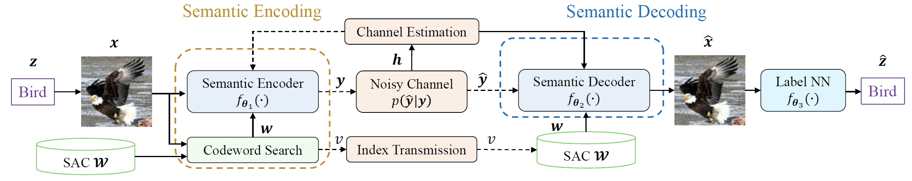

# Codebook-Assisted Image Semantic Communication with a Wyner-Ziv Coding-Based Loss

Pytorch implementation of the [paper](https://xxxx) "Codebook-Assisted Image Semantic Communication with a Wyner-Ziv Coding-Based Loss".

# Introduction
Recently, codebook-assisted semantic communications have been developed to bridge the gap between end-to-end strategies and module-based methods, which have showcased superior performance in data reliability and transmission efficiency. However, most of these approaches encounter two key issues. Firstly, they do not construct the codebook from the semantic perspective, causing a performance decline in semantic information recovery. Secondly, the semantic coder neural network is trained solely on traditional loss functions. Hence, there may be redundancy between the received signal and codeword, which compromises transmission efficiency. In this paper, we tackle the above issues through several key contributions. We first propose a novel approach for constructing a semantic-aware codebook, leveraging an innovative distance measure that unifies the objectives of codebook construction and semantic coding. We also propose a codebook construction method based on classification results, serving as a special version of the proposed method. To further enhance transmission efficiency, we optimize the Swin Transformer-based coder by the proposed Wyner-Ziv coding-based loss function, where a penalty term aims to mitigate the redundancy in the received signals. The performance of the proposed approach is comprehensively validated over both an AWGN channel and a Rayleigh fading channel. Numerical results demonstrate that the proposed method outperforms traditional methods in terms of both semantic information recovery and source data reconstruction.


>  Illustration of the proposed semantic communication system, where the dashed arrows are utilized only over the fading channel.


>  Illustration of the proposed semantic coder structure.


>  Illustration of the SwinJSCC part (from the [paper](https://arxiv.org/abs/2211.00937) "WITT: A Wireless Image Transmission Transformer For Semantic Communications").


# Prerequites
* [Python 3.8]
* [PyTorch 1.9]


# Quick Start

## Codebook Construction

### Task-Unaware Codebook Construction
To construct a task-unaware codebook for the SCC method.
```bash
$ python CB_construction.py
```

### Semantic-Aware Codebook Construction
To construct a task-aware codebook for the PSC and SCSC methods.
```bash
$ python SC_construction.py
```

### Label-Based Semantic-Aware Codebook Construction
To construct a label-based task-aware codebook for the PLSC methods.
```bash
$ python LSC_construction.py
```

## Classifier Pre-Training
To pre-tain the classifier with the raw images for all the methods.
```bash
$ python googlenet_train.py
```


# Usage
* For the AWGN channel, please choose 'WITT_W/O' and 'awgn'
* For the Rayleigh fading channel, please select 'WITT' and 'rayleigh'

## SCC, SCSC, PLSC, PSC Methods
* SCC: trainCBFading.py
* SCSC: trainSCFading.py
* PLSC: trainLSC_LossFading.py
* PSC: trainSC_LossFading.py

```bash
$ python {trainCBFading.py/trainSCFading.py/trainLSC_LossFading.py/trainSC_LossFading.py} --training --trainset STL10 --testset STL10 --distortion-metric {MSE/MS-SSIM} --model {'WITT'/'WITT_W/O'} --channel-type {awgn/rayleigh} --C {4/8/12/16/20} --multiple-snr {2/4/6/8/10} --seed seed --SCsize {16, 32, 64}
```

## SJSCC Method
```bash
$ python trainTSMfading.py --training --trainset STL10 --testset STL10 --distortion-metric {MSE/MS-SSIM} --model {'WITT'/'WITT_W/O'} --channel-type {awgn/rayleigh} --C {4, 8, 12, 16, 20} --multiple-snr {2, 4, 6, 8, 10} --seed seed
```

## JCA Method

To obtain the performance of the JCA method.
```bash
$ python JPEG2000Fading.py --training --trainset STL10 --testset STL10 --channel-type {awgn/rayleigh} 
```

To obtain the recovered image for a specific image. Please change the file name of the raw image to 'raw.jpg' or others.
```bash
$ python JPEG2000_save.py
```

# Experimental results

## AWGN channel


>  Results across the compression rates over the AWGN channel, SNR = 10 dB.


>  Results across the SNRs over the AWGN channel, compression rate is 1.03 percent.


>  Recovered images over the AWGN channel. The compression rate is 1.03 percent and SNR = 6 dB.


## Rayleigh channel


# Citation

Please use the following BibTeX citation if you use this repository in your work:

xxxxx

# Acknowledgement
The implementation is based on [WITT: A Wireless Image Transmission Transformer For Semantic Communication](https://github.com/KeYang8/WITT).


