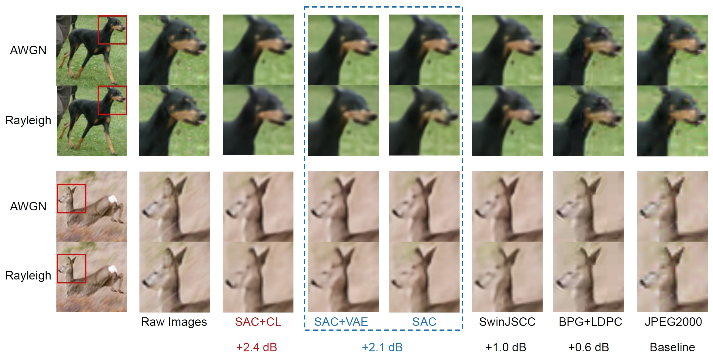

# Codebook-Assisted Image Semantic Communications (Swin Transformer-Based Approach)

Pytorch implementation of the [paper](https://ieeexplore.ieee.org/document/10654371) "Improving Learning-Based Semantic Coding Efficiency for Image Transmission via Shared Semantic-Aware Codebook". The NN backbone is Swin Transformer.

# Introduction
Semantic communications have emerged as a new communication paradigm that extracts and transmits meaningful information relevant to receiver tasks. The trendy semantic coding framework, namely, learning-based joint source-channel coding (JSCC), lies on data-driven principles, with its efficacy depending on the employed neural networks (NNs). This paper introduces a codebook-assisted semantic coding method to improve JSCC performance for image transmission. Notably, a well-constructed codebook is employed to map each source image into a codeword, which subsequently provides shared prior information to assist semantic coding with general NN architectures. The main novelty is two-fold. First, we propose a general semantic-aware codebook construction method based on weighted data-semantic distance. In the case where the semantic information is characterized by discrete labels, this method is refined by encapsulating the labels into codeword indexes. Second, we derive a novel information-theoretic loss function via variational approximation for end-to-end training of the semantic encoder and decoder. This loss function includes a penalty term to mitigate redundancy in the received signals concerning codewords. Extensive experiments conducted over both additive noisy channels and fading channels validate the superior performance of the proposed method with even small-sized codebooks in both image reconstruction and classification accuracy.


>  Illustration of the proposed semantic communication system, where the dashed arrows are utilized only over the fading channel.


>  Illustration of the proposed semantic coder structure.


>  Illustration of the SwinJSCC part (from the [paper](https://arxiv.org/abs/2211.00937) "WITT: A Wireless Image Transmission Transformer For Semantic Communications").


# Prerequites
* [Python 3.8]
* [PyTorch 1.9]


# Quick Start

## Codebook Construction

### Task-Unaware Codebook Construction
To construct a task-unaware codebook for the SCC method.
```bash
$ python CB_construction.py
```

### Semantic-Aware Codebook Construction
To construct a task-aware codebook for the PSC and SCSC methods.
```bash
$ python SC_construction.py
```

### Label-Based Codebook Construction
To construct a label-based task-aware codebook for the PLSC methods.
```bash
$ python LSC_construction.py
```

## Classifier Pre-Training
To pre-tain the classifier with the raw images for all the methods.
```bash
$ python googlenet_train.py
```


# Usage

## PS
* For the AWGN channel, please choose 'WITT_W/O' and 'awgn'
* For the Rayleigh fading channel, please select 'WITT' and 'rayleigh'
* When using the proposed loss function, performance may be erratic in some cases. Therefore, depending on the actual situation, you may need to use a smaller weight value.
* It is recommended to train the pre-training model on AWGN channels with a high SNR. Then, based on the pre-trained model, train again at other SNRs or over the Rayleigh fading channel to achieve a more stable performance.
* To obtain performance with different codebooks or at different SNRs, it is only necessary to utilize the codec trained based on one codebook or at one SNR as a pre-trained model, and then fine-tune it to achieve rapid convergence of the semantic codec training.

## CB w/o Loss, SAC w/o Loss, LC w Loss, SAC w Loss
* CB w/o Loss: trainCBFading.py
* SAC w/o Loss: trainSCFading.py
* LC w Loss: trainLSC_LossFading.py
* SAC w Loss: trainSC_LossFading.py

```bash
$ python {trainCBFading.py/trainSCFading.py/trainLSC_LossFading.py/trainSC_LossFading.py} --training --trainset STL10 --testset STL10 --distortion-metric {MSE/MS-SSIM} --model {'WITT'/'WITT_W/O'} --channel-type {awgn/rayleigh} --C {4/8/12/16/20} --multiple-snr {2/4/6/8/10} --seed seed --SCsize {10, 32, 64, 128}
```

# Experimental results


## Performance at Different CRs


>  Performance at different CRs over the AWGN channel, where the SNR is 10 dB.


>  Performance at different CRs over the Rayleigh fading channel, where the average SNR is 10 dB.


## Performance at Different SNRs


>  Performance at different SNRs over the AWGN channel, where r = 7.40%.


>  Performance at different average SNRs over the Rayleigh fading channel, where r = 7.40%.

## Visualization Results


>  Illustration of the raw image and reconstructed images over the AWGN channel and the Rayleigh channel, where the SNR is 4 dB, h is the identity matrix, and r = 9.25%.


# Citation

Please use the following BibTeX citation if you use this repository in your work:

```
@ARTICLE{10654371,
  author={Zhang, Hongwei and Tao, Meixia and Sun, Yaping and Letaief, Khaled B.},
  journal={IEEE Transactions on Communications}, 
  title={Improving Learning-Based Semantic Coding Efficiency for Image Transmission via Shared Semantic-Aware Codebook}, 
  year={2025},
  volume={73},
  number={2},
  pages={1217-1232},
  keywords={Semantics;Encoding;Indexes;Transformers;Receivers;Transmitters;Image coding;Semantic communications;codebook construction;variational approximation},
  doi={10.1109/TCOMM.2024.3450877}}
```


# Acknowledgement
The implementation is based on [WITT: A Wireless Image Transmission Transformer For Semantic Communication](https://github.com/KeYang8/WITT).


# Contact
Please contact zhw_ieee802@163.com if you have any questions about the codes.


